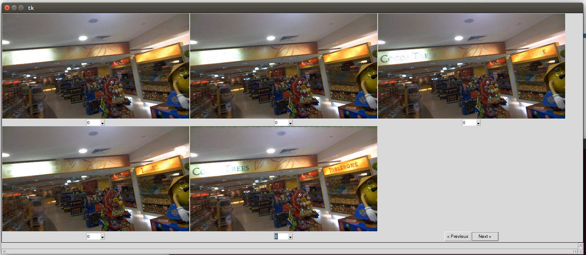
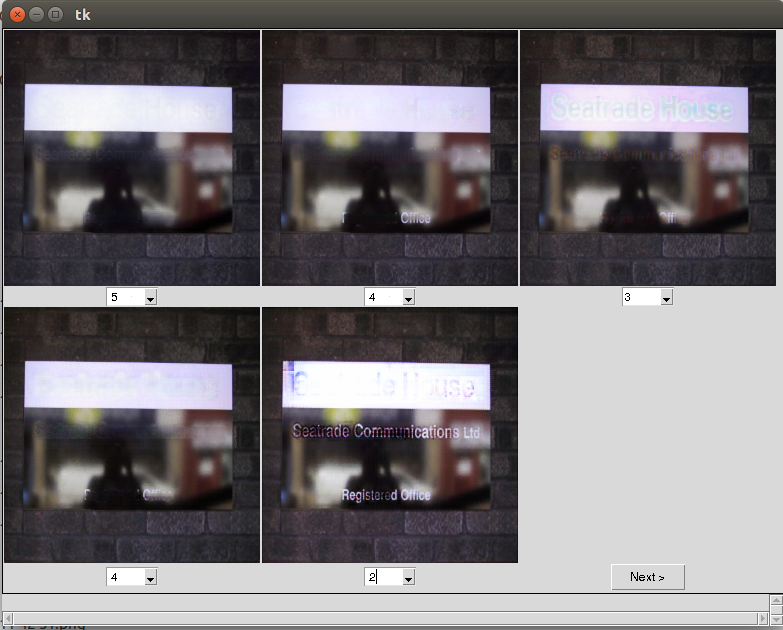

# MOS-Rating
The tool for rating the quality of the image under the following point of consideration:

* Image should not contains anomaly such as color artifacts, blurring, color distortion etc.(rating decrease in case of anomaly)
* Text removal is done properly with removed region is painted with background pixels (rating decrease if text retain on the image)
* Non-text regions cannot be removed accidently (rating decrease if non text region removed)

## Scores: 
This tool consist of output of five different methods (the description of the method is not given for fair assessment). Each image have an assoicated rating drop down box (bottom of each image). The allowed values of scores are five discrete values. These values are 1, 2, 3, 4,and 5. The rating 5 is for excellent, whereas the 1 is for bad.

## Installation:

The application is written in python and depend on following dependency:
1. Numpy
2. pandas
3. PIL

For installation, please use the following command in the anaconda prompt for Windows and terminal for Linux.


```conda env create -f mos.yml```

```conda activate mos```

## Execution:
To start the application place the images from the following [google drive link](https://drive.google.com/drive/folders/1PzC4oPg953FuzZvwnqquXFHQZDi9dnnI?usp=sharing) and unzip it. The directory structure should be 

    .
    ├── images                       # unzipped folder donwloaded from google drive 
    │   ├── Method1                  # Method 1 outputs
    │   ├── Method2                  # Method 2 outputs
    │   ├── Method3                  # Method 3 outputs
    │   ├── Method4                  # Method 4 outputs
    │   ├── Method5                  # Method 5 outputs
    ├── app_rating_restart_rezie.py  # code for rating 
    
The execute the following command

``` python app_rating_restart_rezie.py```

## GUI



For fresh restart please delete the rating.csv and counter.npy files. 

## Sample Images 




